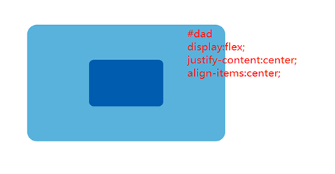
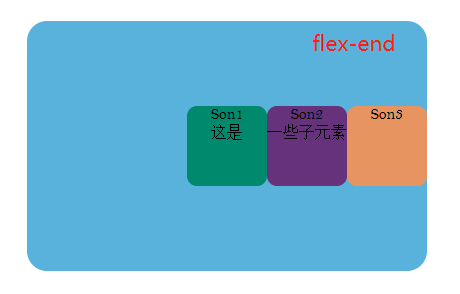
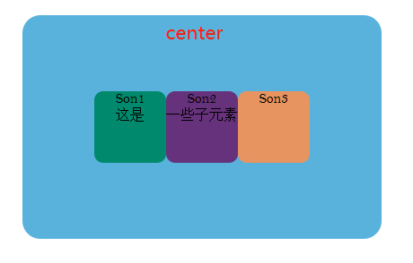
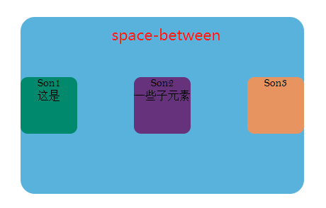
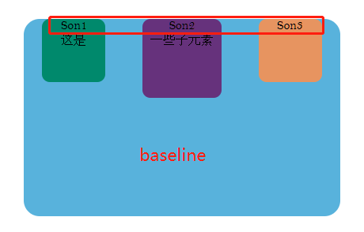
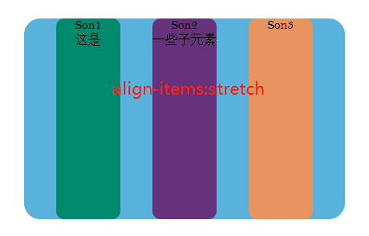

# flex 
> flex布局 -- 更为优雅的方式实现水平、垂直同时居中

## 从flex常用方法中学习基本概念

> 通常情况下使用 


``` html
<div id="dad">
    <div id="son"></div>
</div>
<!--
    <div id="dad">
        <div id="son1"></div><div id="son2></div><div id="son3></div>
    </div>
-->
```

> 上面书写的结构用来配合后面的图片来说明一些flex的相干属性

### 容器

> 父容器可以统一设置子容器的排列方式，子容器也可以单独设置自身的排列方式，如果两者同时设置，以子容器的设置为准。

- 父容器 属性值  `justify-content` | `align-items`

    - `justify-content:flex-start` **[起始端对齐]**
    
    
    
    - `justify-content:flex-end` **[末端对齐]**
    
    
    
    - `justify-content:center` **[居中对齐]**
    
    
    
    - `justify-content:space-between` **[两端对齐]**
    
    
    
    - `justify-content:space-around` **[左右自身margin一致]**
    
    
    
    - `justify-content:space-evenly` **[间距相等]**
    
    
    
    - `align-items:center` **[声明子元素居中对齐]**
    
    
    
    - `align-items:baseline` **[声明子元素基线对齐]**[基线：首行文字与交叉轴起始点最大距离]
    
    
    
    - `align-items:stretch` **[子元素沿交叉轴拉至父元素一致][使用这个属性时，不可对子元素设置高度(交叉轴长度)，否则失效]**
    
    
    
- 子容器


### 轴